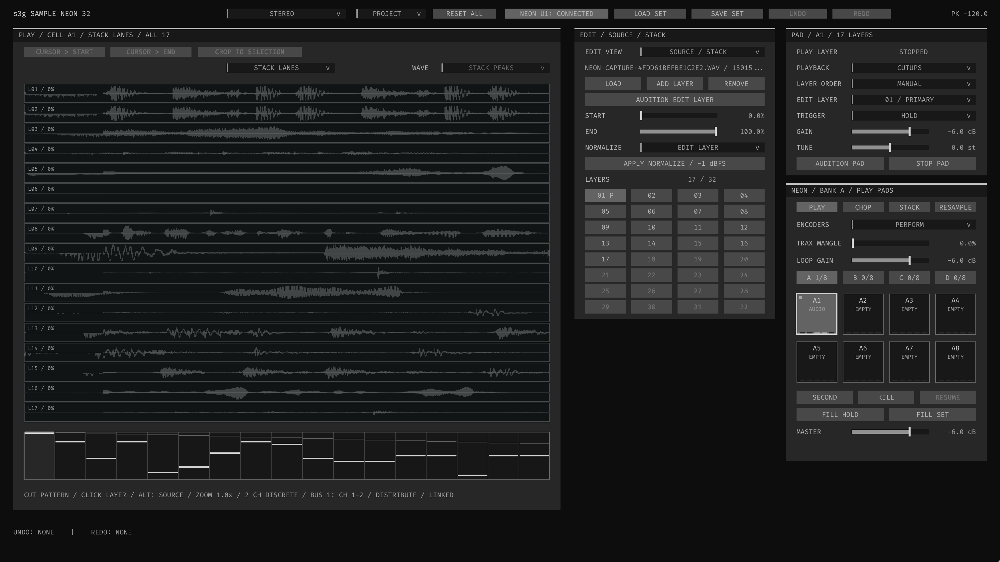
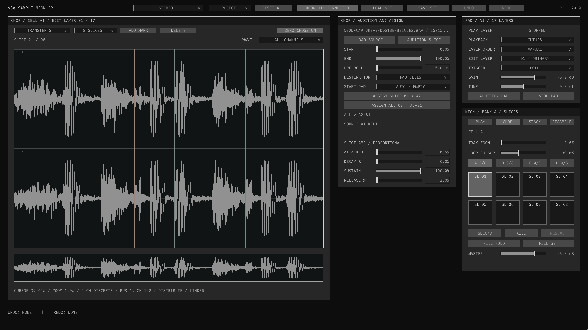

# s3g Sample Neon 32

A performance sampler for one sample, a bank of chops, or a stack of evolving
textures. Play 32 pad cells, give each cell up to 32 sample layers, and choose
from nine playback methods. Use the on-screen controls, MIDI, or one or two
Reloop NEON controllers.

[Read the illustrated user guide](../../docs/sample-neon.html)

## Start with a sample

1. Insert Sample Neon 32 on a track, select Stereo, and monitor channels 1–2.
2. Select A1 in PLAY. Drop an audio file onto the pad, or open
   Edit View → Source / Stack → Load.
3. Press Audition Pad. Choose Edit Layer in the waveform-view menu to adjust
   Start/End; scroll over the waveform to zoom.
4. Choose a Playback method in the PAD toolbox. Open Edit View → Playback
   for its controls.
5. Save the host project. Project storage collects samples alongside a saved
   REAPER project; Link references files, and Embed includes audio in the
   project or a saved set.

For Motion or Grains textures, try Hold with Free / Pad clock. Attack and
Release shape the whole pad press; Grain Size shapes individual grains.

## Chop, layer and perform

- **PLAY:** perform pads and edit their sources, playback, stack path, effects
  and routing without leaving the main workspace.
- **CHOP:** create up to 32 slices and assign them to pad cells or one pad's
  layer stack. Check Start Pad/Target Pad and the destination preview before
  assigning.
- **STACK:** use pads to navigate the layers inside the selected cell.
- **RESAMPLE:** capture Neon's output or incoming track audio. Record toggles
  on/off; Take / Next Layer continues recording into another empty layer.

Sample plays the source directly. Lanes moves through layers; Motion and Grains
create moving textures; Stretch changes traversal duration; Wavesets rearranges
cycles; Slice Sequence plays chopped regions; Spectral freezes and reshapes
frequency content; Cutups makes clocked fragment patterns across the stack.

Each pad also has Character FX: Filter, Echo, Space, Shift, Vowel, Punch, Drive
and Crush. Stereo, quad, octo and ACN/SN3D sources use the same instrument.
Choose a matching output layout and host routing for multichannel material.

## Edit with a way back

Use Crop to Selection to keep only the desired audio. Normalize can target the
edit layer or a whole stack. Right-click cells or layer positions to copy,
paste or clear them.

Undo/Redo covers destructive sample edits, slice assignments, recorded takes
and Reset All. History is not saved with the project, so save a set before a
major rework. Original audio files are not deleted by these editing commands.

## NEON and Tracker

Use **Utility Neon MIDI → Tracker → Sample Neon 32** for recording hardware
performances as notes. Tracker is optional for live playing. Keep one Sample
Neon LED owner and do not add a MIDI hardware return to NEON.

Two controllers can play different sample banks, or one can navigate samples
while the other plays a chromatic, scale or manual keyboard. On the keyboard's
primary SAMPLE page, A–D changes its key range without moving the software's
sample bank or editing page.

- [Utility setup, keyboard layouts and note maps](../../docs/utility-neon-midi.html)
- [Sample Neon controls, recording and troubleshooting](../../docs/sample-neon.html)
- [Multichannel routing](../../docs/sample-neon.html#routing)
- [Storage and portable sets](../../docs/sample-neon.html#storage)
