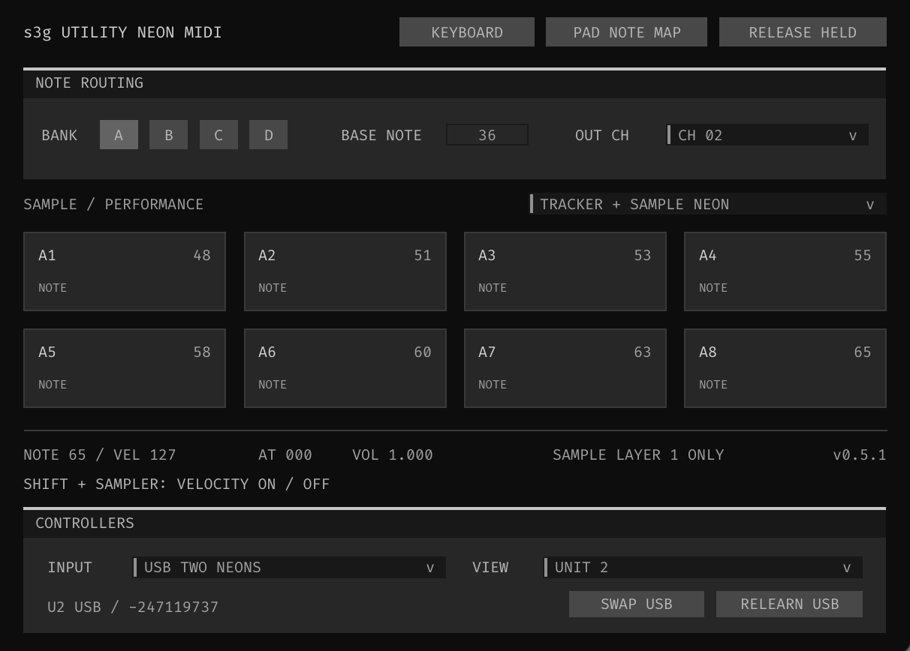

# s3g Utility Neon MIDI

Turn one or two Reloop NEON controllers into bank-aware sample pads or a pitch
keyboard. Utility sends notes to Tracker, Sample Neon 32 or another MIDI
instrument; it does not make sound itself.

[Read the illustrated user guide](../../docs/utility-neon-midi.html)

## Connect and play

Place **Utility Neon MIDI → Tracker → Sample Neon 32** in the track's normal FX
chain. Leave out Tracker for live playing without sequencing.

1. Choose Host MIDI for one controller arriving through the track input, or
   USB One Neon / USB Two Neons for direct USB input on macOS.
2. Set Control Route to Tracker + Sample Neon. For sample pads, start with
   Base Note 36 and Output Channel 1.
3. In Sample Neon, use Follow Utility for its note map, receive the matching
   channel, and enable Neon Owner on this instance only.
4. Keep the track processing/monitored and the hardware on primary SAMPLER.
   Press a loaded pad and check the NOTE and VEL readouts.

Do not add a parallel raw-controller route or a MIDI hardware send back to
NEON. For two controllers, use separate USB connections without the Smart Link
cable. View selects the unit you inspect; Swap USB exchanges assignments.

## Sample pads or a keyboard?

Open Keyboard and select a unit's Pad Role:

- **Pad Cells / Custom Map:** each note addresses a sample cell. The default
  map is A: 36–43, B: 44–51, C: 52–59 and D: 60–67.
- **Keyboard:** pads play pitches on a sample pinned to the output channel.
  Choose Chromatic, Scale or Manual layout. A–D selects eight-key ranges
  without moving Sample Neon's selected sample, bank or editing page.

For a keyboard example, use Unit 2 on channel 2 and assign channel 2 to a
Chromatic pad in Sample Neon's Routing → Notes / Voices. Use Poly for chords.
Keep Unit 1 in Pad Cells on channel 1 for sample navigation.

## Two different note editors

**Pad Note Map** assigns 32 unique MIDI notes to the instrument's sample cells.
Both controllers share it. Edit this map in Utility and keep Sample Neon on
Follow Utility.

**Keyboard → Edit Manual Notes** assigns pitches to one controller's 32 banked
keys. Repeated pitches are allowed; -1 means OFF. From Scale fills a starting
layout from the selected scale, and From A1 fills consecutive semitones.

Both editors support Copy/Paste List and keep changes as a draft until Apply.
Cancel leaves the current setup alone. Manual Keyboard maps remain available
when you switch back to a scale.

## Velocity, aftertouch and recording

Shift + Sampler on the hardware toggles velocity sensitivity. With it off,
notes still play at velocity 127. Utility displays NOTE, VEL, AT (aftertouch)
and VOL (velocity on a 0–1 scale).

Primary SAMPLE pads record as musical notes. CHOP, STACK, RESAMPLE and other
editing controls remain available without adding notes to Tracker's pattern.
Match Tracker's armed lane channel to the intended sample or keyboard route.

Use Notes Only for another instrument. It keeps notes and velocity but omits
Sample Neon editing and LED synchronization. Keyboard poly aftertouch still
passes; Pad Cells aftertouch requires the Sample Neon control route.

Release Held ends notes held through Utility. Use Stop Pad or Kill in the
instrument for sounds that continue in One Shot or Toggle mode.

- [All four Utility panels and their controls](../../docs/utility-neon-midi.html)
- [Keyboard setup and independent ranges](../../docs/utility-neon-midi.html#keyboard-setup)
- [Troubleshooting](../../docs/utility-neon-midi.html#troubleshooting)
- [Sample Neon 32 user guide](../../docs/sample-neon.html)
